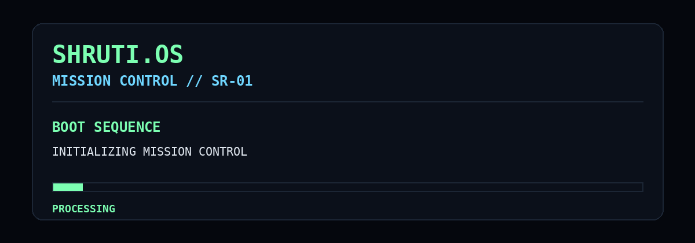

<!--
  SHRUTI.OS // PROFILE README
  Palette: void #050816 · indigo #312E81 · electric cyan #67E8F9 · violet #A78BFA · solar #FBBF24
-->

  

<i>Data Science student · Intelligent systems builder · Curious about what comes next</i>

  

  
  
  

  
  
  

## ◈ Command Deck

> **Welcome aboard.** I’m **Shruti Nair**, a Data Science student building at the intersection of machine learning, intelligent agents, and data-driven systems.

I like work that makes information useful: teaching models to see, helping language systems reason, and designing AI workflows that can take meaningful action.

<table>
  <tr>
    <td width="50%" valign="top">
      <h3>◉ Current trajectory</h3>
      
Building intelligent, data-driven applications while going deeper into <b>Agentic AI</b>, NLP, machine learning, and cloud systems.

    </td>
    <td width="50%" valign="top">
      <h3>◌ Research signals</h3>
      
Computer Vision · NLP · LLMs · Autonomous Workflows · Decision Intelligence

    </td>
  </tr>
</table>

## ✦ Active Missions

<table>
  <tr>
    <td width="33%" valign="top">
      <h3>SR-01 · Literature Intelligence</h3>
      
An AI-assisted research exploration system for navigating and reasoning over academic papers.

      
    </td>
    <td width="33%" valign="top">
      <h3>SR-02 · Breed Recognition</h3>
      
Dual-pipeline vision system identifying Indian cattle and buffalo breeds, plus muzzle detection.

      
    </td>
    <td width="33%" valign="top">
      <h3>SR-03 · Disaster Intelligence</h3>
      
NLP system that prioritises disaster-related social signals by urgency and information value.

      
    </td>
  </tr>
</table>

  

## ◫ Systems Online

  

  
  
  

## ◌ Mission Telemetry

  

  

  
<b>Mission archive · click to decrypt</b>

   

  - AI / ML internship
  - National hackathon participant
  - Best visualization award
  - Research publication and copyright
  - Agentic AI, Data Science, and Deep Learning certifications

---

<i>Building toward the next useful, intelligent thing.</i>

